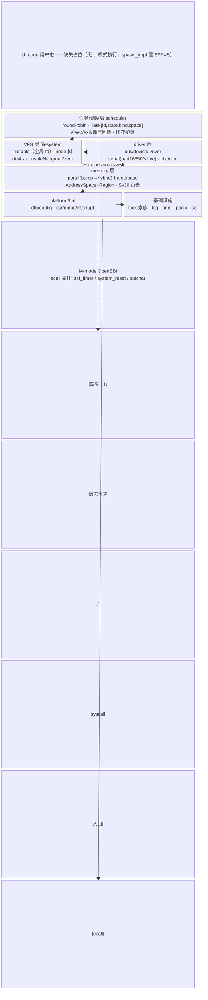
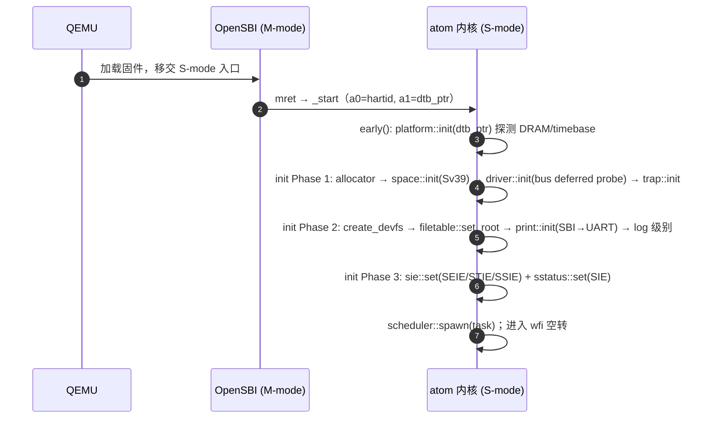
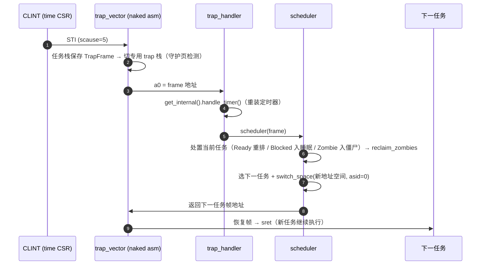
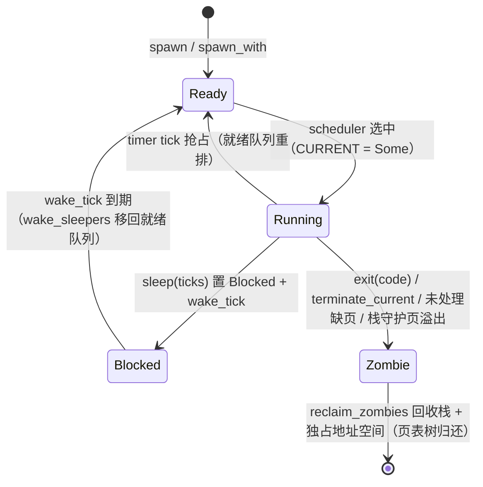

# atom 架构梳理

> 本文档从 **项目自身** 出发梳理 atom 内核的架构现状与模块缺失——
> 参照系不是某个外部操作系统，而是项目自己的三个内部来源：
> ① CLAUDE.md / ROADMAP 声明的设计意图；② 代码注释里自我表达的预期；
> ③ 代码中留下的 TODO/预留标记。凡"缺失"均为这三者与代码现状的差距。

## 1. 现状总览

- **目标平台**：RISC-V 64（`riscv64gc-unknown-none-elf`），QEMU `virt`，单 hart。
- **特权级**：M-mode OpenSBI → S-mode atom 内核。M-mode 操作经 `ecall` 委托
  （`sbi.rs`：`set_timer` / `system_reset` / `putchar`）。
- **内存**：Sv39 分页，内核低半区 identity 映射 + 高半区映射（预留）；门户分配器
  （bump → hybrid）+ Buddy 物理帧分配器。
- **任务**：trap 驱动的 round-robin 抢占，每任务独立 `AddressSpace`（`from_kernel`
  浅克隆共享内核半区）+ 固定栈窗口（`TASK_STACK_BASE=0xC0000000`）+ 守护页。
- **设备**：Linux 式 bus/device/driver 模型，DTB 发现 → compatible 匹配 → deferred
  probe；实例经 `bus::find` 跨驱动访问。
- **文件**：VFS（`File` trait + `Inode` 树 + 全局 fd 表）+ devfs（纯内存节点）。

### 引导序列

```
QEMU → OpenSBI (M-mode) → mret → _start → early() → main → init::run()
  Phase 1  allocator → space::init（Sv39 启用）→ driver::init（bus probe）→ trap::init
  Phase 2  create_devfs → filetable::set_root → print::init（SBI→UART）→ log 级别
  Phase 3  sie::set(SEIE|STIE|SSIE) + sstatus::set(SIE)
main → scheduler::spawn(...) → wfi 空转
```

## 2. 架构图

### 2.1 分层图（现状 + 缺失占位）

```
┌───────────────────────────────────────────────────────────────────────────┐
│ U-mode  ──── 缺失占位 ────────────────────────────────────────────────────   │
│   无 U 模式执行：spawn_impl 置 sstatus SPP=Supervisor（scheduler.rs:552-553） │
│   （虚线以下为 S-mode 内核；U-mode 需要 syscall 入口与 U 标志页表）            │
├───────────────────────────────────────────────────────────────────────────┤
│ S-mode  atom 内核                                                            │
│                                                                             │
│  ┌── 任务 / 调度层 scheduler ──────────────────────────────────────────┐    │
│  │ Task{id,state,kind,space,stack} · round-robin（固定时间片）          │    │
│  │ sleep(ticks) / exit(code) / terminate_current · 僵尸栈回收           │    │
│  │ spawn/spawn_with（独立地址空间 + 栈守护页）· CURRENT 单锁             │    │
│  │ 缺失：优先级/时间片、fork/wait、IPC、per-task fd 表、U-mode 切换      │    │
│  └───────────▲─────────────────────────────────────────────────────────┘    │
│              │ STI（定时器 tick → scheduler）                                │
│  ┌───────────┴────────── trap 层（横切）───────────────────────────────┐    │
│  │ trap_vector(naked) → trap_handler                                    │    │
│  │  STI→scheduler · SEI→PLIC claim→INTERRUPT_HANDLERS→complete           │    │
│  │  SSI→仅清 SSIP（无 IPI 消费） · 缺页→memory::fault                    │    │
│  │  其他同步异常（含 ecall）→ User terminate / kernel panic              │    │
│  │ 缺失：ecall/syscall 分发（trap.rs:283-287 直接 terminate）            │    │
│  └──────┬──────────────────────────────┬───────────────────────────────┘    │
│         │ 切换空间/缺页                │ 中断源/MMIO                       │
│  ┌──────▼──── VFS 层 filesystem ────┐ ┌▼────── driver 层 ──────────────┐  │
│  │ filetable：全局 fd 表（偏移由     │ │ bus：匹配/deferred probe/find  │  │
│  │   OpenFile 持有，read/write 传参）│ │ device + traits（Driver trait）│  │
│  │ inode：静态树（引导期构建后不可变）│ │ serial：uart16550 / sifive_uart│  │
│  │ devfs：consoleN/log/null/zero     │ │ controller：plic / clint       │  │
│  │   （纯内存节点）                   │ │ 缺失：存储类驱动、remove/热插拔│  │
│  │ 缺失：Regular 文件、mount、真实 FS│ └────────────┬──────────────────┘  │
│  └──────┬────────────────────────────┘              │ MMIO 映射/中断注册  │
│         │ devfs 注入 serial 实例（bus::find）        │                    │
│  ┌──────▼──────── memory 子系统 ────────────────────▼──────────────────┐  │
│  │ allocator：portal（bump→hybrid）· frame（Buddy）· page（页帧）        │  │
│  │ space：AddressSpace + Region（Anonymous/Reserved）· KERNEL_SPACE     │  │
│  │ table/entry/addr · fault（匿名页懒分配缺页解析）                      │  │
│  │ 缺失：ASID 使用（switch_space 支持但恒传 0）、superpage、             │  │
│  │       copy_from/to_user、mmap 系 API（unmap/protect 均 dead_code）    │  │
│  └──────┬───────────────────────────────────────────────────────────────┘  │
│  ┌──────▼──────── platform / hal ─────────────────────────────────────┐   │
│  │ platform：dtb（FDT 解析）/config/header（DRAM/MMIO/时钟频率探测）    │   │
│  │ hal：csr（S-mode CSR 封装）/mmio/interrupt（单实例注册面）/cpu       │   │
│  └──────┬─────────────────────────────────────────────────────────────┘   │
│  ┌──────▼──────── 基础设施 ───────────────────────────────────────────┐   │
│  │ lock（Spin/Bare/Rw/Rel/Once/Lazy）· log（五级+模块过滤）· print       │   │
│  │ panic（CSR dump+backtrace+reset）· macros · sbi（ecall 封装）        │   │
│  └─────────────────────────────────────────────────────────────────────┘   │
├───────────────────────────────────────────────────────────────────────────┤
│ M-mode  OpenSBI — ecall 委托：set_timer / system_reset / putchar            │
└───────────────────────────────────────────────────────────────────────────┘
```

### 2.2 模块依赖图（现状实线 + 缺失虚线）

```
main ──► init ──► allocator::init ──► space::init ──► driver::init ──► trap::init
                   │                    │                 │
                   │                    │           ┌─────┴──────┐
                   │                    │           ▼            ▼
                   │                    │       serial::DRIVERS controller::DRIVERS
                   │                    │       （uart16550/    （plic/clint）
                   │                    │         sifive_uart）
                   │                    │                 │ bus::find
                   │                    │                 ▼
                   │                    │            [Plic] ◄── uart probe 依赖
                   ▼                    ▼                 │
              create_devfs ──► driver::serial::all ───────┘
                   │
                   ▼
              print::init ──► driver::serial::console
                   ▲
                   │
   log ──► print ──┘        panic ──► print(MWriter) ──► sbi
                                          ▲
   trap ──► scheduler ◄── STI             │
     │        │  │                        └──► sbi::system_reset / csr dump
     │        │  └─► memory::switch_space（asid=0 恒量）
     │        └────► memory::{frame,page,space::kernel_space}
     ├─► memory::fault ──► space::page_fault ──► frame/page
     └─► hal::interrupt（claim/complete）─► INTERRUPT_HANDLERS ──► handler

缺失模块（虚线占位，随实现逐步实线化）：
  [U-mode 执行] ──► scheduler（SPP 切换/用户栈/用户堆布局）
  [syscall 分发] ──► trap（ecall 分发表）──► 内核服务
  [copy_from/to_user] ──► memory（syscall 参数安全访问）
  [per-task FileTable] ──► scheduler::Task（替换全局 filetable）
  [ELF loader] ──► scheduler::spawn（fn() 指针 → 进程镜像）
  [fork/exec/wait] ──► scheduler（生命周期扩展）
  [IPC/信号] ──► scheduler + filetable
  [真实 FS] ──► VFS（mount 点）──► [块设备驱动(virtio-blk)] ──► bus
  [ASID 分配器] ──► memory::switch_space
  [多核 per-hart] ──► scheduler::CURRENT / hal::cpu / hal::interrupt::IPI
  [msleep/定时器抽象] ──► hal::interrupt::InternalInterrupt
```

### 2.3 模块依赖图（Mermaid graph TD）

```mermaid
graph TD
    subgraph priv["特权级"]
        U["U-mode（缺失占位：无 U 模式执行）"]:::missing
        S["S-mode atom 内核"]
        M["M-mode OpenSBI（ecall: set_timer/system_reset/putchar）"]
    end

    subgraph task_layer["任务/调度层"]
        SCHED["scheduler<br/>round-robin · Task{id,state,kind,space,stack}<br/>sleep/exit/zombie 回收 · 守护页"]
        FDT["per-task FileTable（缺失）"]:::missing
        PROC["fork/exec/wait（缺失）"]:::missing
        IPC["IPC/信号（缺失）"]:::missing
    end

    subgraph vfs_layer["VFS 层"]
        FSTAB["filetable（全局 fd 表）"]
        INODE["inode 树（Directory/ByteDevice）"]
        DEVFS["devfs: consoleN/log/null/zero"]
        REALFS["真实 FS + mount（缺失）"]:::missing
        BLK["块设备驱动 virtio-blk（缺失）"]:::missing
    end

    subgraph drv_layer["driver 层"]
        BUS["bus: 匹配/deferred probe/find"]
        UART["serial: uart16550 / sifive_uart"]
        CTRL["controller: plic / clint"]
    end

    subgraph mem_layer["内存与平台层"]
        MEM["memory: allocator(portal→hybrid)/frame/page"]
        SPACE["space: AddressSpace + Region"]
        FAULT["fault: 匿名页懒分配"]
        ASID["ASID 分配器（缺失）"]:::missing
        COPY["copy_from/to_user（缺失）"]:::missing
        UEXEC["U-mode 执行切换（缺失）"]:::missing
        SYSCALL["syscall 分发表（缺失）"]:::missing
        PLAT["platform: dtb/config"]
        HAL["hal: csr/mmio/interrupt/cpu"]
    end

    subgraph infra["基础设施"]
        LOCK["lock 家族"]
        LOG["log"]
        PRINT["print"]
        PANIC["panic"]
        SBI["sbi"]
    end

    TRAP["trap: trap_vector → trap_handler"]:::cross
    TRAP -->|STI| SCHED
    TRAP -->|SEI claim/complete| CTRL
    TRAP -->|缺页| FAULT
    TRAP -->|ecall（缺失分发）| SYSCALL
    SCHED -->|switch_space asid=0| SPACE
    SCHED -->|frame/page| MEM
    SCHED --> FDT
    SCHED --> PROC
    SCHED --> IPC
    FDT --> FSTAB
    SYSCALL --> COPY
    UEXEC --> SCHED
    DEVFS -->|serial::all| UART
    UART -->|bus::find| CTRL
    REALFS -->|mount| INODE
    BLK --> REALFS
    BUS --> UART
    BUS --> CTRL
    PRINT -->|serial::console| UART
    PRINT -->|MWriter| SBI
    LOG --> PRINT
    PANIC --> PRINT
    PANIC --> SBI
    SBI --> M
    U --> S
    S --> M

    classDef missing fill:#fdd,stroke:#933,stroke-dasharray: 5 5;
    classDef cross fill:#eef,stroke:#369;
```



### 2.4 分层全景（block-beta）

> 与 2.1 的 ASCII 分层图同一视图的 Mermaid 版：嵌套块表达 S-mode 内核内五层，
> 虚线表达 U-mode 缺失占位与 M-mode 委托。渲染需 Mermaid v10.8+（block-beta）。



### 2.5 时序视图（sequenceDiagram）

**引导序列**——从 QEMU 上电到 idle 空转：



**定时器中断（抢占/调度）**——一次 STI 从硬件到任务切换的完整路径：



### 2.6 任务状态机（stateDiagram-v2）

> scheduler.rs 的 TaskState 语义（Ready/Blocked/Zombie，Running 隐含于 CURRENT）。



## 3. 模块清单

| 子系统 | 模块                                        | 状态     | 证据                                        |
| --- | ----------------------------------------- | ------ | ----------------------------------------- |
| 启动  | `_start`/`early`/`main`/`init::run` 四阶段   | ✅ 有    | main.rs:34-135, init.rs:46-88             |
| 平台  | DTB 解析 / PlatformConfig                   | ✅ 有    | platform/dtb.rs, config.rs                |
| 平台  | SBI ecall 封装                              | ✅ 有    | sbi.rs（冷/热重启为预留）                          |
| 内存  | Portal 分配器（bump→hybrid）                   | ✅ 有    | memory/allocator/portal.rs                |
| 内存  | 物理帧分配器（Buddy）/ 页帧                         | ✅ 有    | memory/allocator/frame.rs, page.rs        |
| 内存  | Sv39 页表 / AddressSpace / Region           | ✅ 有    | memory/table.rs, space.rs                 |
| 内存  | 缺页处理（匿名页懒分配）                              | ✅ 有    | memory/fault.rs                           |
| 内存  | mmap/munmap/mprotect 语义                   | ⚠️ 预留  | space.rs:189/207/327（dead_code）           |
| 内存  | ASID 独立分配                                 | ⚠️ 半成品 | memory/mod.rs:37 支持，scheduler.rs:243 恒传 0 |
| 内存  | Superpage（2MB/1GB）                        | ❌ 缺    | —                                         |
| 内存  | copy_from/to_user                         | ❌ 缺    | —                                         |
| 锁   | SpinLock/BareLock/RwLock/RelLock/OnceLock | ✅ 有    | lock/                                     |
| 锁   | LazyLock                                  | ⚠️ 未用  | lock/mod.rs:40                            |
| 中断  | CLINT（timer）/ PLIC（外部）                    | ✅ 有    | driver/controller/                        |
| 中断  | IPI 消费                                    | ⚠️ 预留  | interrupt.rs:20, trap.rs:213-218 仅清 SSIP  |
| 中断  | 多中断控制器共存                                  | ❌ 缺    | interrupt.rs:24/59 单实例 OnceLock           |
| 驱动  | bus/device/driver 模型 + deferred probe     | ✅ 有    | driver/bus.rs                             |
| 驱动  | 串口（NS16550A / SiFive）                     | ✅ 有    | driver/serial/                            |
| 驱动  | 驱动移除 / 热插拔                                | ❌ 缺    | bus.rs 无 remove 路径                        |
| 任务  | round-robin 调度 / sleep / exit / 僵尸回收      | ✅ 有    | scheduler.rs                              |
| 任务  | 独立地址空间 + 栈守护页                             | ✅ 有    | scheduler.rs:482-574                      |
| 任务  | U-mode 用户态执行                              | ❌ 缺    | scheduler.rs:552-553 置 SPP=S              |
| 任务  | syscall 框架（ecall 分发）                      | ❌ 缺    | trap.rs:283-287 直接 terminate              |
| 任务  | fork/exec/wait                            | ❌ 缺    | —                                         |
| 任务  | IPC / 信号                                  | ❌ 缺    | —                                         |
| 任务  | per-task 文件描述符表                           | ❌ 缺    | filetable.rs:46 TODO（全局表）                 |
| 任务  | 优先级 / 时间片                                 | ❌ 缺    | scheduler.rs:80 round-robin 固定            |
| VFS | File trait / Inode 树 / 全局 fd 表            | ✅ 有    | filesystem/                               |
| VFS | devfs（consoleN/log/null/zero）             | ✅ 有    | filesystem/dev/                           |
| VFS | 真实文件系统（磁盘 FS）/ mount                      | ❌ 缺    | inode.rs:20-25 仅两类节点                      |
| 存储  | 块设备驱动                                     | ❌ 缺    | —                                         |
| 输出  | M-mode/S-mode 分层输出                        | ✅ 有    | print.rs（U-mode 路径为声明未实现）                 |
| 日志  | 五级 + 模块过滤 + 时间戳                           | ✅ 有    | log.rs                                    |
| 多核  | per-hart 结构 / 真实 hartid                   | ❌ 缺    | scheduler.rs:90, cpu.rs:33 TODO           |
| 时间  | msleep / 高精度定时抽象                          | ❌ 缺    | 仅 scheduler.rs:429 sleep(ticks)           |

## 4. 缺失分析

### 4.1 分组一：设计意图未落地（ROADMAP 下一步 + CLAUDE.md 声称）

| # | 缺失项 | 现状证据 | 说明 |
|---|--------|----------|------|
| 1 | **U-mode 用户态进程** | scheduler.rs:552-553 置 `SPP=Supervisor`；spawn 只收 `fn()` 指针（scheduler.rs:482） | ROADMAP「用户态与系统调用」；无 U 标志页表、无用户栈/堆布局、无 ELF 加载 |
| 2 | **ecall 系统调用框架** | trap.rs:283-287 同步异常（含 ecall）对 User 任务直接 terminate | ROADMAP 要求 open/read/write/ioctl 分发 |
| 3 | **进程调度增强** | scheduler.rs:80 固定 round-robin，无优先级/时间片 | ROADMAP：优先级、时间片、fork/exit 完整语义 |
| 4 | **Superpage** | 页表路径仅 4KiB（table.rs） | ROADMAP：2MB L1 / 1GB L2 |
| 5 | **ASID 独立分配** | memory/mod.rs:37-41 已支持参数，scheduler.rs:243 恒传 0 | ROADMAP：每任务独立 ASID、TLB 局部刷新 |
| 6 | **多核启动** | scheduler.rs:90、hal/cpu.rs:33 TODO | ROADMAP：多 hart 唤醒、per-hart 栈/CURRENT/中断 |
| 7 | **msleep / 时间管理** | 仅 scheduler.rs:429 `sleep(ticks)` | ROADMAP：高精度定时器、msleep 抽象 |
| 8 | **virtio-blk 块设备** | driver/ 无存储类驱动 | ROADMAP「外设与存储」 |
| 9 | **简单文件系统** | inode.rs:20-25 仅 Directory/ByteDevice；devfs 纯内存 | ROADMAP：FAT32 或自制极简 FS |
| 10 | **U-mode 打印 / 每进程 fd 表** | print.rs:6,17 注释声明；filetable.rs:6 注释声明 | CLAUDE.md 未来时态声称，无实现 |

### 4.2 分组二：架构自洽性缺口（内部不闭环，写明卡住了什么）

| # | 缺口 | 证据 | 卡住 / 阻碍 |
|---|------|------|-------------|
| 1 | syscall 分发缺失 | `TaskKind::User` 已存在（scheduler.rs:49-54），ecall 直接 terminate（trap.rs:283-287） | U-mode 任务无法调用任何内核服务，用户态落地即死 |
| 2 | per-task FileTable 无落点 | filetable.rs:46 TODO；全局静态表（filetable.rs:47） | 多任务 fd 隔离、fd 随进程生命周期、fork 继承语义 |
| 3 | devfs 无真实存储 | inode.rs:20-25 仅两类节点；devfs 引导期一次性构建 | 常规文件/深层目录无法表达；VFS 无法承载用户数据 |
| 4 | ASID 半成品 | switch_space 支持 asid（memory/mod.rs:37），调度器恒传 0（scheduler.rs:243） | 任务切换全量 `sfence.vma`，TLB 性能与隔离 |
| 5 | mmap 系 API 悬空 | unmap/protect/region_remove/share_kernel 全 dead_code（space.rs:189/207/277/327） | 动态内存管理（堆扩展/共享内存/fork 空间复制）无内核入口 |
| 6 | 单中断控制器 | INTERNAL/EXTERNAL 单实例 OnceLock（interrupt.rs:24,59） | ACLINT/APLIC 等并存或热切换不可能 |
| 7 | 高半区映射未启用 | 已建高半区（space.rs:421，注释"为 S-mode 切换做准备"），内核跑低半区 identity | 低半区被内核占满则用户 VA 受限；`TASK_STACK_BASE` 依赖 DRAM<1GiB（space.rs:392-398） |
| 8 | exit code 无 wait | scheduler.rs:369 退出码无人读取 | 进程退出状态回收、父子同步语义缺失 |
| 9 | IPI 无消费逻辑 | trap.rs:213-218 SSI 仅清 SSIP | 跨核唤醒/信号投递不可能 |
| 10 | U-mode 声称与实现不符 | print.rs:6,17 声称 U-mode 输出路径 | 文档与代码认知偏差，误导后续开发 |

### 4.3 分组三：代码自述欠账（TODO / 预留）

| # | 欠账 | 位置 |
|---|------|------|
| 1 | 多 hart：CURRENT 改 per-hart 数组 | scheduler.rs:90 |
| 2 | 多 hart：从 tp/mhartid 读真实 hartid | hal/cpu.rs:33 |
| 3 | IPI `trigger_soft` dead_code（单 hart 未用） | hal/interrupt.rs:20 |
| 4 | FileTable 移入进程对象 | filesystem/filetable.rs:46 |
| 5 | unmap/protect/share_kernel/region_remove 预留 dead_code | memory/space.rs:189/207/277/327 |
| 6 | U-mode ecall 输出路径声明未实现 | print.rs:6,17 |
| 7 | SBI 冷/热重启预留（当前仅关机） | sbi.rs:39/42 |
| 8 | LazyLock 可用未使用 | lock/mod.rs:40 |
| 9 | DTB 原始属性查询工具预留 | platform/dtb.rs:49/305 |
| 10 | PermissionDenied/NotDirectory 错误码、seek/control(ioctl) API 预留 | filesystem/traits.rs:16/24/66/83/93/109, filetable.rs:133/148 |
| 11 | VirtAddr 对齐/分类工具预留 | memory/addr.rs:68/75/127 |
| 12 | BareLock/SpinLock try_lock 非阻塞获取预留 | lock/bare.rs:68, lock/spin.rs:76 |

## 5. 建议路线（按依赖前置排序）

```
第 1 波 · 用户态地基（互相依赖，需一起做）
  U-mode 执行切换（SPP=User、U 标志页表、用户栈/堆布局、trap 进出 U）
  + syscall 分发表（ecall 编号 → 内核服务表）
  + copy_from/to_user（用户内存边界检查）
  └ 打通后：用户任务可调用 open/read/write/exit

第 2 波 · 进程化
  per-task FileTable（fd 表移入 Task，替换全局表）
  + ELF loader（spawn 从 fn() 指针扩展为进程镜像）
  + fork/exec/wait（生命周期 + 退出码回收，接通 share_kernel）
  + IPC/信号（管道/信号投递）

第 3 波 · 存储
  virtio-blk 块设备驱动（挂 bus，新 Driver 模型）
  + 简单文件系统（FAT32 或自制）+ VFS mount（InodeType 增加 Regular）
  + mmap 系 API 接通（unmap/protect 作为文件/匿名映射的 syscall 后端）

第 4 波 · 并发与性能
  多核：per-hart CURRENT / 真实 hartid / IPI 消费 / 多核启动（SBI HSM）
  + ASID 分配器（switch_space 实参化）
  + superpage（map_region 大页路径）
  + msleep / 定时器抽象

第 5 波 · 收尾与易用
  bus remove / 热插拔 · LazyLock 启用 · 错误码接入 · 中断控制器多实例化
```

## 6. 关键设计约束备忘

- `TASK_STACK_BASE=0xC0000000` 依赖内核不映射低半区 L2[3] 且 DRAM < 1 GiB
  （space.rs:392-398 有 boot 断言）——做用户 VA 布局时需重新审视。
- 调度器 `NEXT_FRAME` / `frame_phys` 依赖"物理 DRAM 恒为 identity 映射"——
  若引入真实物理内存管理（非恒等）会破坏跨任务帧访问。
- 所有任务当前共享内核半区页表（`from_kernel` 浅克隆 + `shared_l2` 释放保护）——
  用户态落地的隔离边界在于低半区私有映射 + U 标志。
