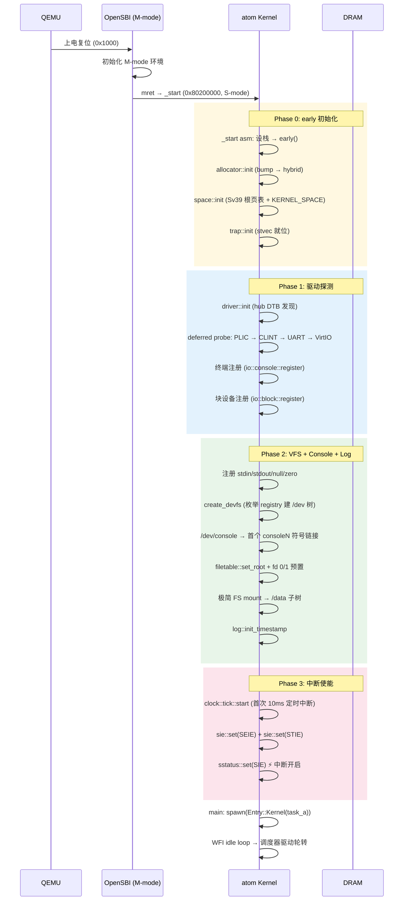
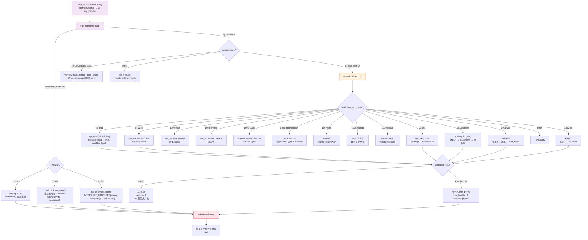
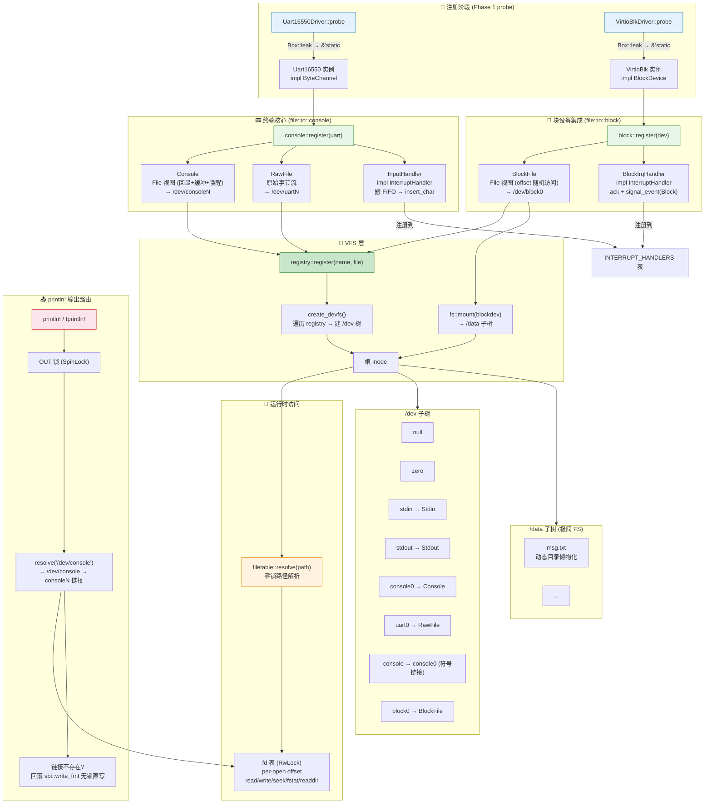
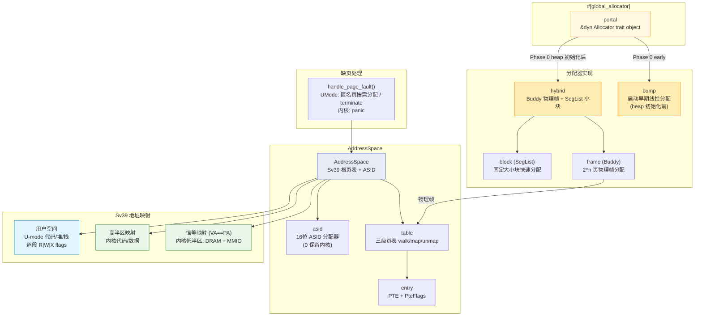
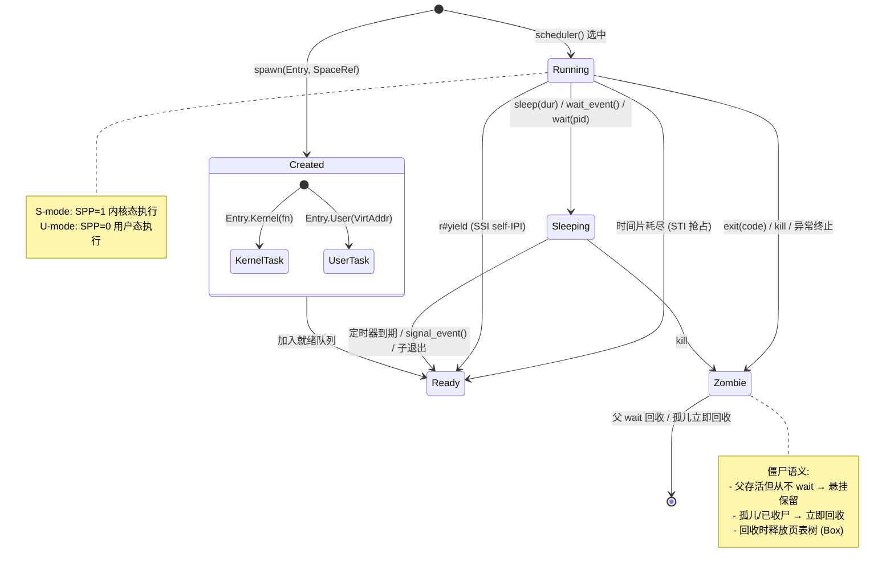
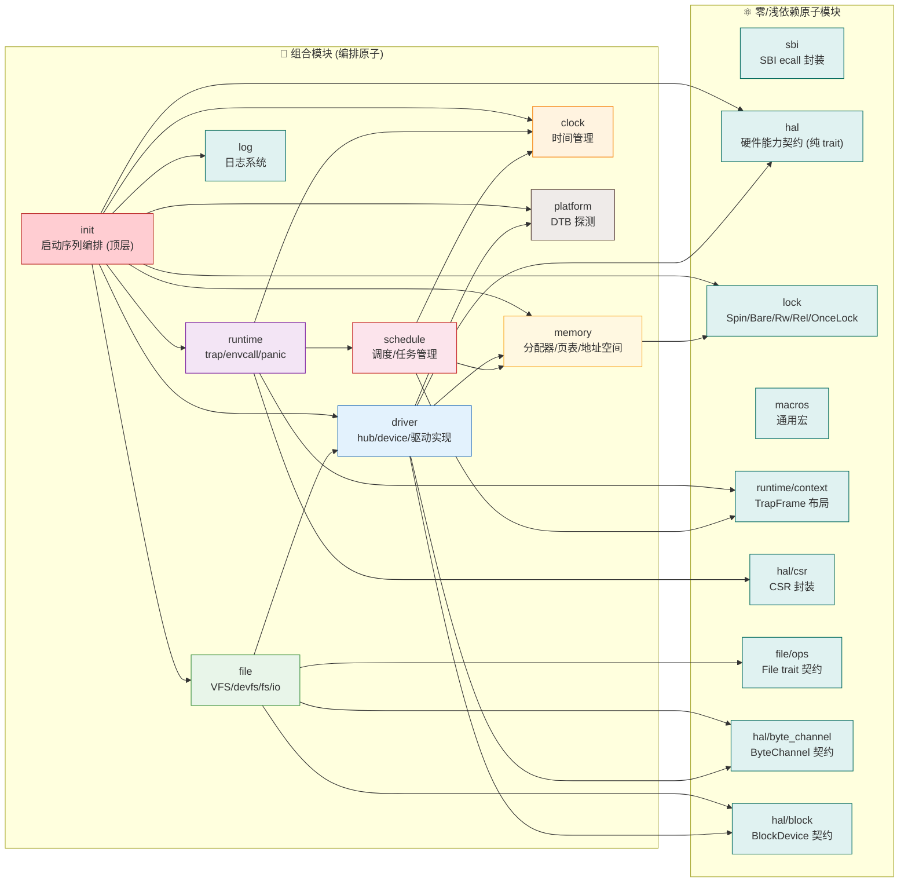

# atom 系统架构图

> 本文件以 Mermaid 图呈现 atom 内核的整体架构。
> 代码事实以各模块契约文档 (`docs/src/*.md`) 为准。

---

## 1. 分层架构总览

```mermaid
graph TB
    subgraph User["👤 U-mode"]
        UPROG["用户程序 (ET_EXEC ELF)"]
        SHELL["内部 Shell (shell.rs)"]
    end

    subgraph Syscall["🔀 系统调用层 (runtime/envcall.rs)"]
        ECALL["Ecall 分发<br/>read/write/exit/spawn/wait/kill<br/>open/close/seek/map/unmap<br/>gettimeofday/fstat/readdir/create"]
    end

    subgraph VFS["📁 VFS + 服务集成 (file/)"]
        FILETABLE["filetable<br/>fd 表 + offset 管理"]
        INODE["Inode 树<br/>静态 children + 动态 Directory"]
        REGISTRY["registry<br/>File 注册表"]
        CONSOLE["io/console<br/>终端核心(Console/RawFile/InputHandler)"]
        BLOCKIO["io/block<br/>BlockFile + BlockIrqHandler"]
        FS["fs/<br/>极简 FS: superblock/inode/位图/目录"]
        PRINT["io/print<br/>OUT 锁 + println! 路由"]
        STDIO["io/stdio<br/>Stdin/Stdout"]
    end

    subgraph Schedule["⏱️ 调度层 (schedule/)"]
        SPAWN["spawn<br/>TaskBuilder::loader / TaskBuilder::new"]
        SCHEDULER["scheduler<br/>Round-Robin + CURRENT"]
        SLEEP["sleep<br/>时间阻塞 + 事件等待/通知"]
        WAIT["wait/kill/exit<br/>僵尸回收 + 退出码"]
    end

    subgraph Runtime["⚡ 运行时 (runtime/)"]
        TRAP["trap_handler<br/>中断/异常/ecall 分发"]
        CONTEXT["context<br/>TrapFrame 布局"]
        PANIC["panicking<br/>SBI 直写 + CSR dump + backtrace"]
    end

    subgraph Memory["🧠 内存管理 (memory/)"]
        PORTAL["portal<br/>#[global_allocator] → &dyn Allocator"]
        BUMP["bump (early)"]
        HYBRID["hybrid (Buddy + SegList)"]
        SPACE["AddressSpace<br/>Sv39 页表 + ASID"]
        FAULT["fault<br/>缺页处理"]
    end

    subgraph HAL["🔌 HAL 能力契约 (hal/)"]
        BYTECHAN["ByteChannel<br/>字节收发能力"]
        BLOCKDEV["BlockDevice<br/>块读写能力"]
        INTERRUPT["Interrupt<br/>InternalInterrupt/ExternalInterrupt/InterruptHandler"]
        CSR["csr<br/>S-mode CSR 封装"]
        RTC["rtc<br/>Realtime 契约"]
    end

    subgraph Driver["🔧 驱动层 (driver/)"]
        HUB["hub<br/>DTB 发现 → compatible 匹配 → deferred probe"]
        UART["uart/<br/>NS16550A / SiFive UART"]
        PLIC["controller/plic<br/>外部中断控制器"]
        CLINT["controller/clint<br/>定时器 + IPI"]
        VIRTIO["block/virtio_blk<br/>现代 virtio-mmio 块设备"]
    end

    subgraph Platform["🖥️ 平台层"]
        SBI["sbi<br/>SBI ecall 封装"]
        DTB["platform<br/>DTB 解析 + 全局配置"]
    end

    subgraph HW["🖥️ 硬件 (QEMU riscv64 virt)"]
        CPU["RISC-V Harts"]
        MMIO["UART / PLIC / CLINT / VirtIO"]
        MEM["DRAM"]
    end

    %% User → Syscall
    UPROG -->|"ecall (U→S)"| ECALL
    SHELL --> UPROG

    %% Syscall → VFS / Schedule / Memory
    ECALL --> FILETABLE
    ECALL --> SPAWN
    ECALL --> SPACE

    %% VFS internals
    FILETABLE --> INODE
    FILETABLE --> REGISTRY
    INODE --> CONSOLE
    INODE --> BLOCKIO
    INODE --> FS
    INODE --> STDIO
    FS --> BLOCKIO
    PRINT --> INODE

    %% VFS → HAL
    CONSOLE --> BYTECHAN
    BLOCKIO --> BLOCKDEV
    CONSOLE --> INTERRUPT
    BLOCKIO --> INTERRUPT

    %% Schedule → Memory
    SPAWN --> SPACE
    SCHEDULER --> CONTEXT

    %% Runtime → Schedule
    TRAP --> SCHEDULER

    %% Memory internals
    PORTAL --> BUMP
    PORTAL --> HYBRID
    SPACE --> FAULT

    %% Driver → HAL (implements)
    UART -.->|"impl"| BYTECHAN
    VIRTIO -.->|"impl"| BLOCKDEV
    PLIC -.->|"impl"| INTERRUPT
    CLINT -.->|"impl"| INTERRUPT

    %% Driver → Platform
    HUB --> DTB
    HUB --> UART
    HUB --> PLIC
    HUB --> CLINT
    HUB --> VIRTIO

    %% Platform → HW
    SBI --> CPU
    DTB --> MMIO
    DTB --> MEM

    %% Styling
    classDef user fill:#e1f5fe,stroke:#0288d1
    classDef syscall fill:#fff3e0,stroke:#f57c00
    classDef vfs fill:#e8f5e9,stroke:#388e3c
    classDef sched fill:#fce4ec,stroke:#c62828
    classDef runtime fill:#f3e5f5,stroke:#7b1fa2
    classDef memory fill:#fff8e1,stroke:#f9a825
    classDef hal fill:#e0f2f1,stroke:#00695c
    classDef driver fill:#e3f2fd,stroke:#1565c0
    classDef plat fill:#efebe9,stroke:#4e342e
    classDef hw fill:#eceff1,stroke:#37474f

    class UPROG,SHELL user
    class ECALL syscall
    class FILETABLE,INODE,REGISTRY,CONSOLE,BLOCKIO,FS,PRINT,STDIO vfs
    class SPAWN,SCHEDULER,SLEEP,WAIT sched
    class TRAP,CONTEXT,PANIC runtime
    class PORTAL,BUMP,HYBRID,SPACE,FAULT memory
    class BYTECHAN,BLOCKDEV,INTERRUPT,CSR,RTC hal
    class HUB,UART,PLIC,CLINT,VIRTIO driver
    class SBI,DTB plat
    class CPU,MMIO,MEM hw
```

---

## 2. 启动序列

---

## 3. Trap 分发与系统调用路径

************
---

## 4. VFS 与设备模型

---

## 5. 内存管理架构

---

## 6. 任务模型与生命周期

---

## 7. 模块依赖方向 (原子 vs 组合)

---

## 图例说明

| 颜色 | 层级 | 职责 |
|------|------|------|
| 🟦 浅蓝 | U-mode | 用户程序 / 内部 Shell |
| 🟧 浅橙 | 系统调用 | Ecall 分发 (read/write/exit/spawn/wait...) |
| 🟩 浅绿 | VFS + 服务集成 | 文件抽象 / 终端核心 / 块设备 / 极简 FS / 输出路由 |
| 🟥 浅红 | 调度 | Round-Robin 调度器 / 任务生命周期 |
| 🟪 浅紫 | 运行时 | Trap 分发 / envcall / panic |
| 🟨 浅黄 | 内存管理 | Portal 分配器 / Sv39 页表 / 地址空间 |
| 🟩 青绿 | HAL | 硬件能力契约 (纯 trait, 零依赖) |
| 🟦 蓝 | 驱动 | DTB 发现 + 型号驱动 (UART/PLIC/CLINT/VirtIO) |
| ⬜ 灰 | 平台 | SBI / DTB / 硬件 |
